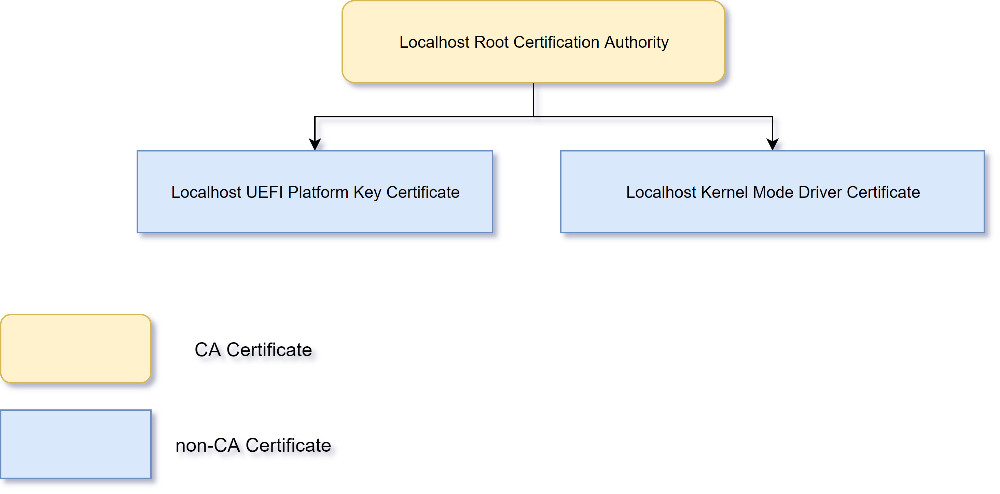

# 创建证书

本节将会创建如下图的一个证书体系。__跟随教程的过程中请不要关闭Powershell。__



## 1. 建立一个根CA证书

根CA是信任的根源，所有由根CA签发的下级证书都是被根CA承认的。

所以你得保管好生成的根CA证书。

管理员运行Powershell：

```powershell
$cert_params = @{
    Type = 'Custom'
    Subject = 'CN=Localhost Root Certification Authority'
    FriendlyName = 'Localhost Root Certification Authority'
    TextExtension = '2.5.29.19={text}CA=1'
    HashAlgorithm = 'sha512'
    KeyLength = 4096
    KeyAlgorithm = 'RSA'
    KeyUsage = 'CertSign','CRLSign'
    KeyExportPolicy = 'Exportable'
    NotAfter = (Get-Date).AddYears(100)
    CertStoreLocation = 'Cert:\LocalMachine\My'
}

$root_cert = New-SelfSignedCertificate @cert_params
```

其中：

1. `TextExtension`

  * `2.5.29.19`是X509证书中`Basic Constraints`域的OID号。
  
  * 后面跟了`CA=1`表明该证书是一个CA证书
  
  * 在`CA=1`后面其实还可以加上`&pathlength=x`，这个是用来限制该CA的下级CA证书链长度。
  
    例如，如果是`&pathlength=2`，则意味着下级CA证书链最多只能到

    ```
    [+] "Localhost Root Certification Authority"
     |- [+] "Intermediate CA 1"
         |- [+] "Intermediate CA 2"
    ```

    再下级的`Intermediate CA 3`是不被该CA证书承认的。当然`Intermediate CA 2`还是可以签发非CA证书的。

    如果`pathlength`未指定，则认为下级CA证书链可以无限长。

这两条指令执行后，你可以在`certlm.msc`的`个人\证书`和`中间证书颁发机构\证书`中看到新生成的证书，其中前者包含私钥，后者不包含私钥。

你可以通过将后者移动到`受信任的根证书颁发机构\证书`来信任该证书。

## 2. 构建内核代码证书

利用刚刚生成的根CA证书，我们生成一份内核驱动证书。

```powershell
$cert_params = @{
    Type = 'CodeSigningCert'
    Subject = 'CN=Localhost Kernel Mode Driver Certificate'
    FriendlyName = 'Localhost Kernel Mode Driver Certificate'
    TextExtension = '2.5.29.19={text}CA=0'
    Signer = $root_cert
    HashAlgorithm = 'sha256'
    KeyLength = 2048
    KeyAlgorithm = 'RSA'
    KeyUsage = 'DigitalSignature'
    KeyExportPolicy = 'Exportable'
    NotAfter = (Get-Date).AddYears(10)
    CertStoreLocation = 'Cert:\LocalMachine\My'
}

$km_cert = New-SelfSignedCertificate @cert_params
```

这两条命令执行后，你可以在`certlm.msc`的`个人\证书`中看到新生成的证书。这份证书你可以用来签署自己编写的内核驱动。

## 3. 构建UEFI Plaform Key证书

这份证书将会安装在UEFI中，作为Platform Key。通过这份证书，你可以控制UEFI的KEK，进而也可以控制DB、DBX。

```powershell
$cert_params = @{
    Type = 'Custom'
    Subject = 'CN=Localhost UEFI Platform Key Certificate'
    FriendlyName = 'Localhost UEFI Platform Key Certificate'
    TextExtension = '2.5.29.19={text}CA=0'
    Signer = $root_cert
    HashAlgorithm = 'sha256'
    KeyLength = 2048
    KeyAlgorithm = 'RSA'
    KeyUsage = 'DigitalSignature'
    KeyExportPolicy = 'Exportable'
    NotAfter = (Get-Date).AddYears(10)
    CertStoreLocation = 'Cert:\LocalMachine\My'
}

$pk_cert = New-SelfSignedCertificate @cert_params
```

关于如何设置Platform Key，这需要主板UEFI固件的支持，并且每台电脑有不同的方法。一般情况就是去UEFI设置界面、找到和SecureBoot相关的设置、Enroll PK即可。需要注意的是，不是所有的UEFI固件都支持修改Platform Key。例如Surface Book系列的，它的UEFI设置界面就没有Enroll PK相关的项。

## 4. 导出证书

在`certlm.msc`的`个人\证书`中导出生成的三份证书，分别为：

```
// 自签名根CA证书
localhost-root-ca.der
localhost-root-ca.pfx

// 自签名根CA颁发的内核代码证书
localhost-km.der
localhost-km.pfx

// 自签名根CA颁发的UEFI Platform Key证书
localhost-pk.der
localhost-pk.pfx
```

注意后缀`.der`代表DER编码的不含私钥的证书，`.pfx`代表含私钥的证书文件。

